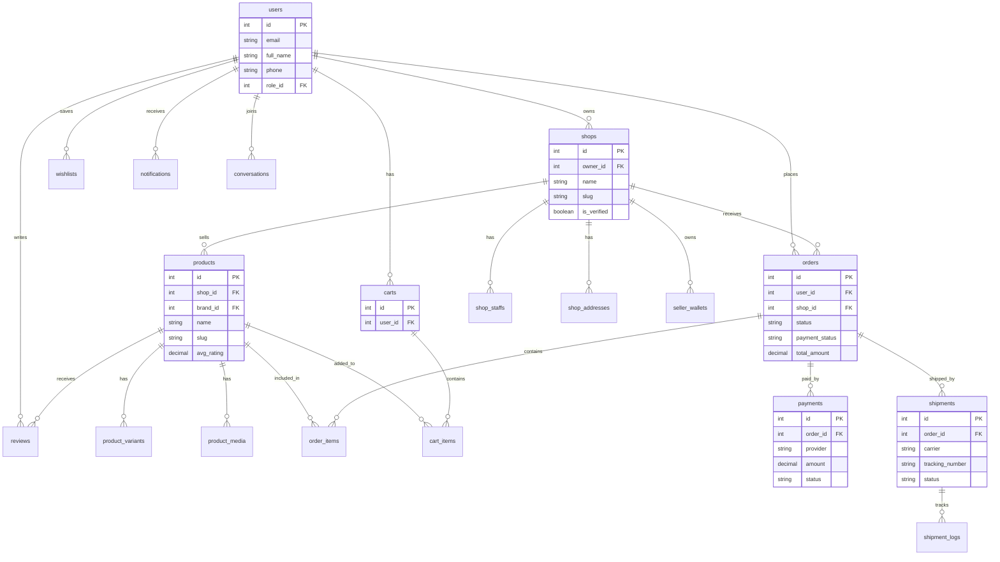
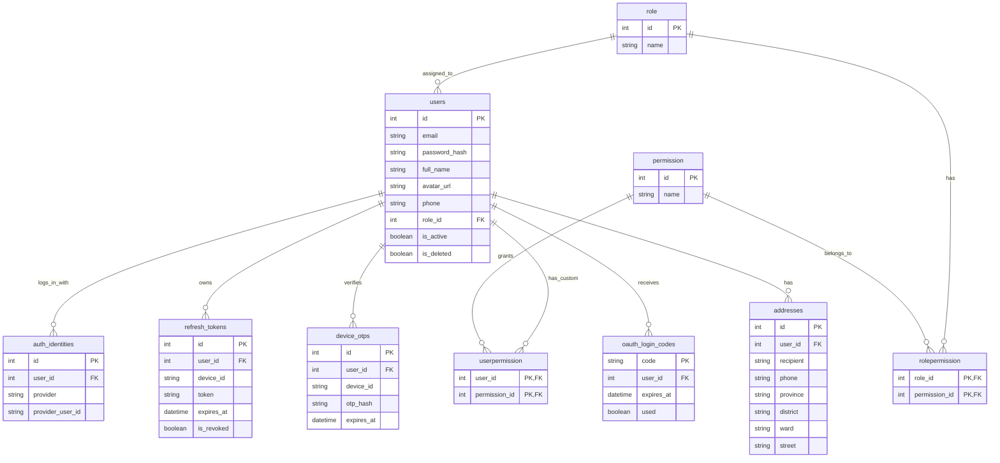
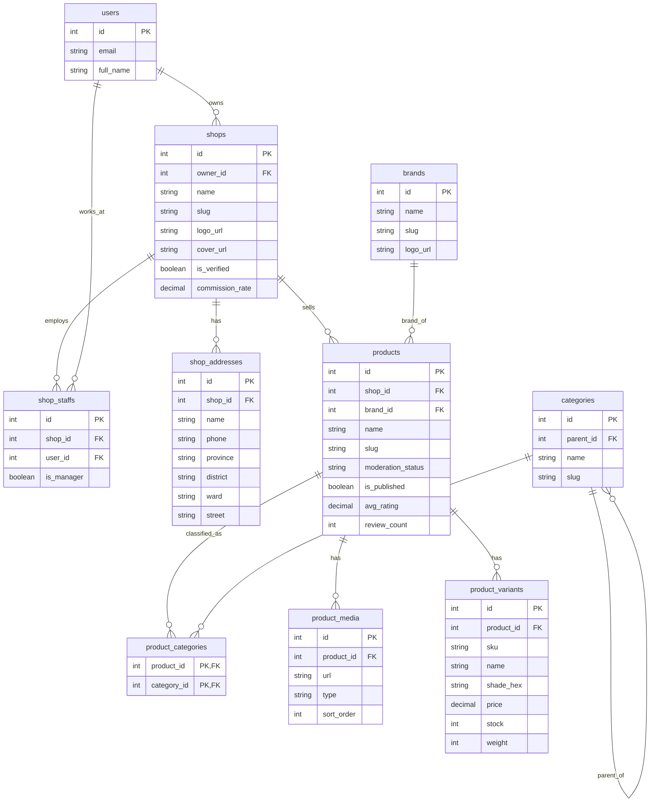
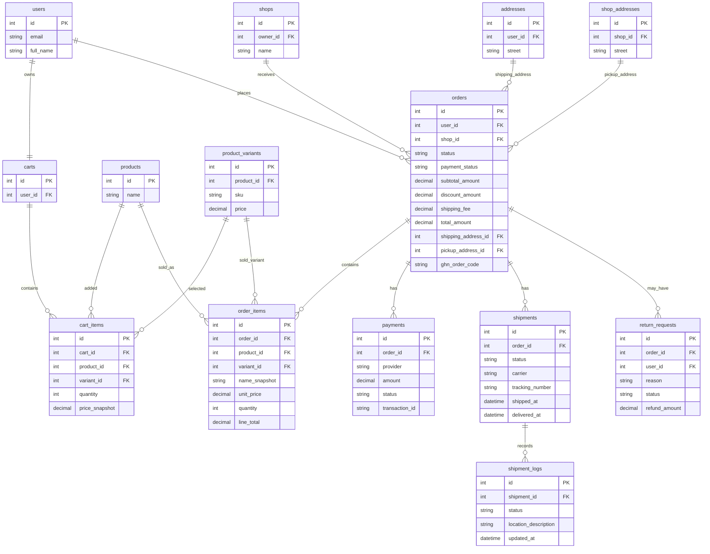
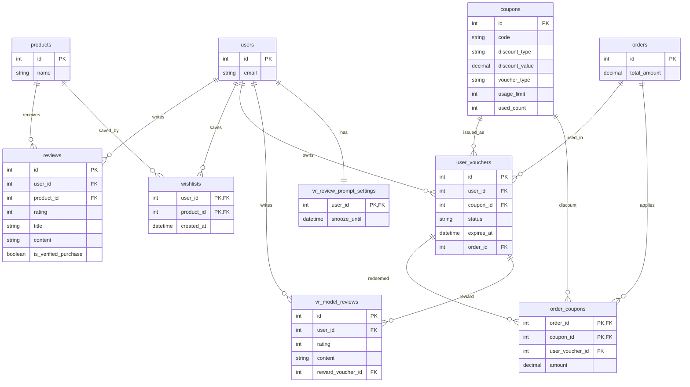
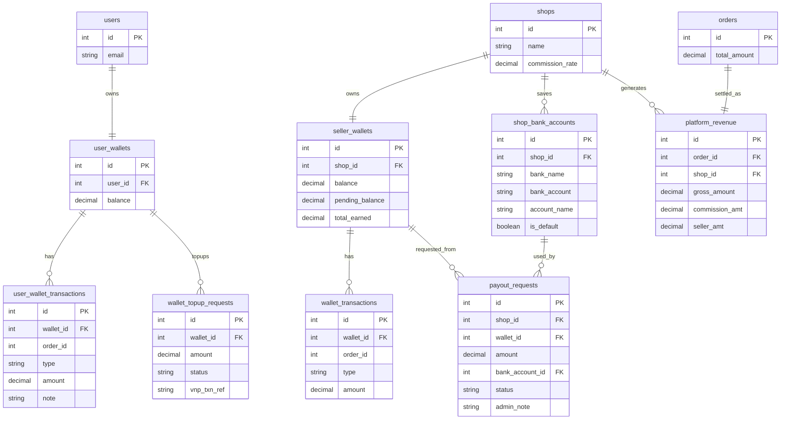
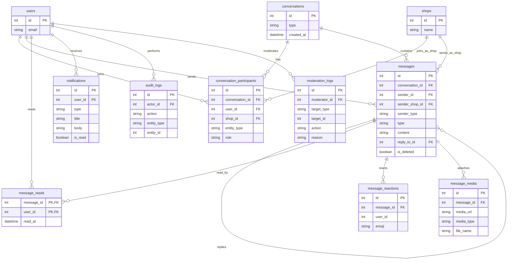
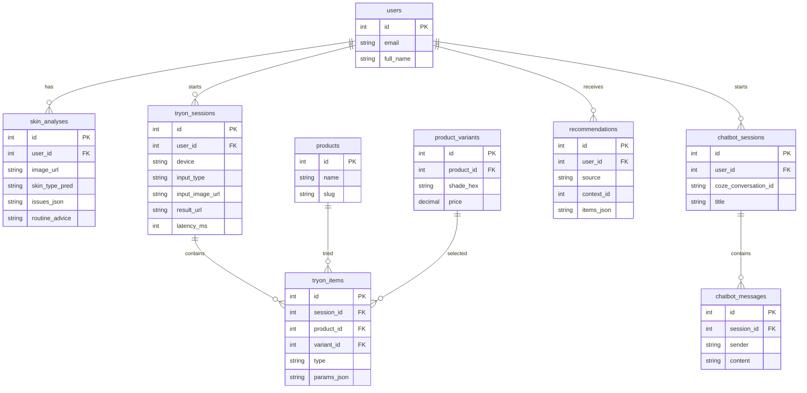
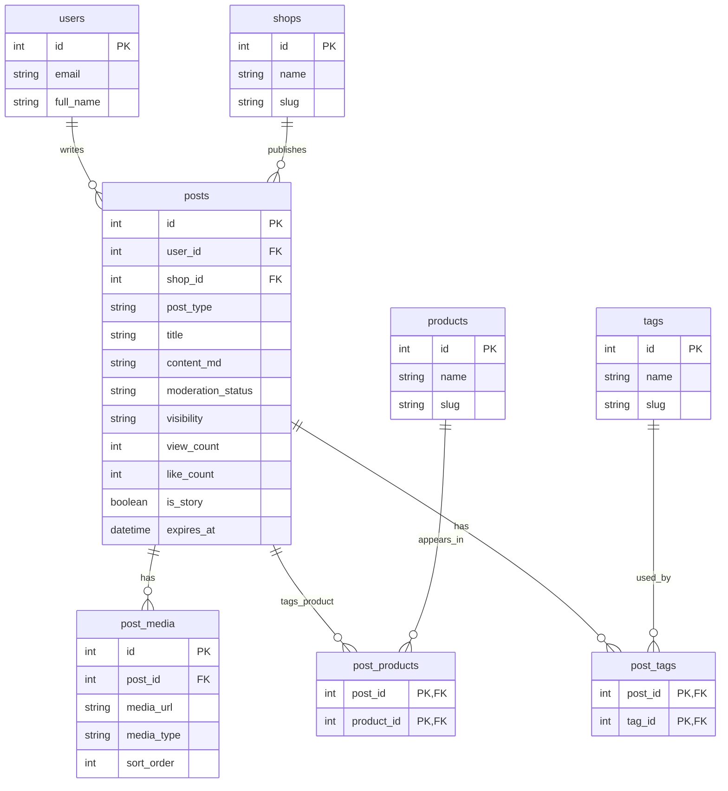

# ERD Mermaid - Beauty E-commerce System

File này chia ERD thành nhiều sơ đồ nhỏ để dễ nhìn, dễ export ảnh và dễ đưa vào báo cáo.

Cách xuất ảnh:

1. Mở https://mermaid.live
2. Copy từng khối `mermaid`
3. Dán vào Mermaid Live Editor
4. Export PNG/SVG để đưa vào báo cáo

## 1. ERD Tổng Quan Hệ Thống

## 2. ERD Người Dùng, Xác Thực Và Phân Quyền

## 3. ERD Cửa Hàng, Sản Phẩm, Danh Mục

## 4. ERD Giỏ Hàng, Đơn Hàng, Thanh Toán, Vận Chuyển

## 5. ERD Đánh Giá, Wishlist, Voucher

## 6. ERD Ví, Doanh Thu, Rút Tiền

## 7. ERD Chat, Tin Nhắn, Thông Báo

## 8. ERD AI, AR Makeup, Chatbot

## 9. ERD Bài Viết Và Social Commerce

